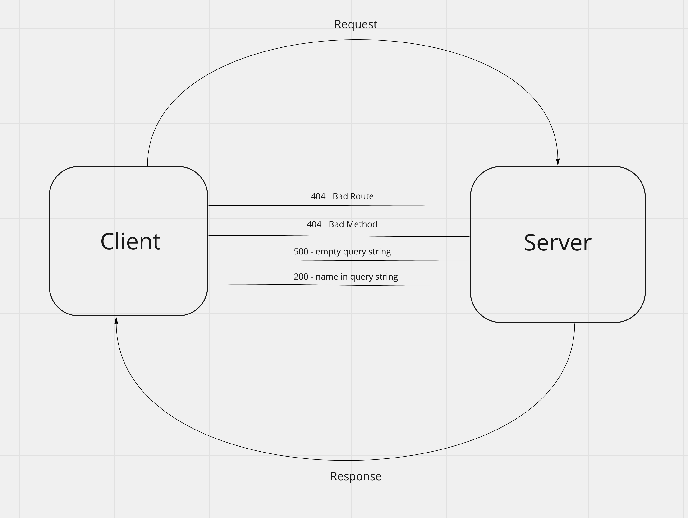

# Basic Express Server

```
Repository Name: basic-express-server

Branch name: dev
```

Deployed URL: [https://jessi-basic-express-server.herokuapp.com/](https://jessi-basic-express-server.herokuapp.com/)

Github Actions: [https://github.com/JessiVelazquez/basic-express-server/actions](https://github.com/JessiVelazquez/basic-express-server/actions)

Pull Request: [https://github.com/JessiVelazquez/basic-express-server/pull/2](https://github.com/JessiVelazquez/basic-express-server/pull/2)


## UML Diagram:



